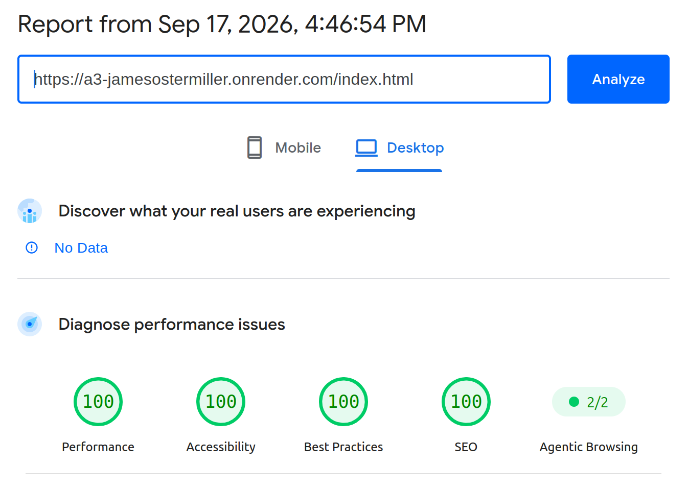

Assignment 3 - Persistence: Two-tier Web Application with Database, Express server, and CSS template
===

Due: September 15th, by 1:59 PM.

This assignment continues where we left off in A2, extending it to use a popular Node.js server framework (express), a database (mongodb), and a CSS application framework / template of your choice (Bootstrap, Material Design, Semantic UI, Pure etc.)

Baseline Requirements
---

Your application is required to implement the following functionalities:

- a `Server`, created using Express (no alternatives will be accepted for this assignment)
- a `Results` functionality which shows all data associated with a logged in user (except passwords)
- a `Form/Entry` functionality which allows users to add, modify, and delete data items (must be all three!) associated with their user name / account. 
- Persistent data storage in between server sessions using [mongodb](https://www.mongodb.com/cloud/atlas) (you *must* use mongodb for this assignment). You can use either the [official mongodb node.js library](https://www.npmjs.com/package/mongodb) or use the [Mongoose library](https://www.npmjs.com/package/mongoose), which enables you to define formal schemas for your database. Please be aware that the course staff cannot provide in-depth support for use of Mongoose.  
- Use of a [CSS framework or template](https://github.com/troxler/awesome-css-frameworks). 
This should do the bulk of your styling/CSS for you and be appropriate to your application. 
For example, don't use [NES.css](https://nostalgic-css.github.io/NES.css/) (which is awesome!) unless you're creating a game or some type of retro 80s site.

Your application is required to demonstrate the use of the following concepts:  

HTML:  
- HTML input tags and form fields of various flavors (`<textarea>`, `<input>`, checkboxes, radio buttons etc.)
- HTML that can display all data *for a particular authenticated user*. Note that this is different from the last assignnment, which required the display of all data in memory on the server.

Note that it might make sense to have two pages for this assignment, one that handles login / authentication, and one that contains the rest of your application.
For example, when visiting the home page for the assignment, users could be presented with a login form. After submitting the login form, if the login is 
successful, they are taken to the main application. If they fail, they are sent back to the login to try again. For this assignment, it is acceptable to simply create 
new user accounts upon login if none exist, however, you must alert your users to this fact.  

CSS:  
- CSS styling should primarily be provided by your chosen template/framework. 
Oftentimes a great deal of care has been put into designing CSS templates; 
don't override their stylesheets unless you are extremely confident in your graphic design capabilities. 
The idea is to use CSS templates that give you a professional looking design aesthetic without requiring you to be a graphic designer yourself.

JavaScript:  
- At minimum, a small amount of front-end JavaScript to get / fetch data from the server. 
See the [previous assignment](https://github.com/cs-4241-23/shortstack) for reference.

Node.js:  
- A server using Express and a persistent database (mongodb).

General:  
- Your site should achieve at least 90% on the `Performance`, `Best Practices`, `Accessibility`, and `SEO` tests 
using Google [Lighthouse](https://developers.google.com/web/tools/lighthouse) (don't worry about the PWA test, and don't worry about scores for mobile devices).
Test early and often so that fixing problems doesn't lead to suffering at the end of the assignment. 

Deliverables
---

Do the following to complete this assignment:

1. Implement your project with the above requirements. I'd begin by converting your A2 assignment. First, change the server to use express. Then, modify the server to use mongodb instead of storing data locally. Last but not least, implement user accounts and login. User accounts and login is often the hardest part of this assignment, so budget your time accordingly.
2. Deploy your project to Render and fill in the appropriate fields in your package.json file.
3. Test your project to make sure that when someone goes to your main page on Render, it displays correctly.
4. Ensure that your project has the proper naming scheme `a3-yourfirstname-yourlastname` so we can find it.
5. Fork this repository and modify the README to the specifications below.
6. Create and submit a Pull Request to the original repo. Name the pull request using the following template: `a3-firstname-lastname`.

Achievements
---

Below are suggested technical and design achievements. You can use these to help boost your grade up to an A and customize the 
assignment to your personal interests, for a maximum twenty additional points and a maximum grade of a 100%. 
These are recommended achievements, but feel free to create/implement your own... just make sure you thoroughly describe what you did in your README, 
why it was challenging, and how many points you think the achievement should be worth. 
ALL ACHIEVEMENTS MUST BE DESCRIBED IN YOUR README IN ORDER TO GET CREDIT FOR THEM.

*Technical*
- (10 points) Implement OAuth authentication, perhaps with a library like [passport.js](http://www.passportjs.org/). 
*You must either use Github authenticaion or provide a username/password to access a dummy account*. 
Course staff cannot be expected, for example, to have a personal Facebook, Google, or Twitter account to use when grading this assignment. 
Please contact the course staff if you have any questions about this. This is the hardest achievement in Webware; you have been warned!  
- (5 points) Get 100% (not 98%, not 99%, but 100%) in all four lighthouse tests required for this assignment.
- (up to 5 points) List up to five Express middleware packages you used and a short (one sentence) summary of what each one does. THESE MUST BE SEPARATE PACKAGES THAT YOU INSTALL VIA NPM, NOT THE ONES INCLUDED WITH EXPRESS. So express.json and express.static don't count here. For a starting point on middleware, see [this list](https://expressjs.com/en/resources/middleware.html).

*Design/UX*
- (10 points) Make your site accessible using the [resources and hints available from the W3C](https://www.w3.org/WAI/), Implement/follow twelve tips from their [tips for writing](https://www.w3.org/WAI/tips/writing/), [tips for designing](https://www.w3.org/WAI/tips/designing/), and [tips for development](https://www.w3.org/WAI/tips/developing/). *Note that all twelve must require active work on your part*. 
For example, even though your page will most likely not have a captcha, you don't get this as one of your twelve tips to follow because you're effectively 
getting it "for free" without having to actively change anything about your site. 
Contact the course staff if you have any questions about what qualifies and doesn't qualify in this regard. 
List each tip that you followed and describe what you did to follow it in your site.
- (5 points) Describe how your site uses the CRAP principles in the Non-Designer's Design Book readings. 
Which element received the most emphasis (contrast) on each page? 
How did you use proximity to organize the visual information on your page? 
What design elements (colors, fonts, layouts, etc.) did you use repeatedly throughout your site? 
How did you use alignment to organize information and/or increase contrast for particular elements. 
Write a paragraph of at least 125 words *for each of the four principles* (four paragraphs, 500 words in total).

Sample Readme (delete the above when you're ready to submit, and modify the below so with your links and descriptions)
---

## Your Web Application Title

A link to your project running on render.

Include a very brief summary of your project here. Images are encouraged, along with concise, high-level text. Be sure to include:

- the goal of the application
- challenges you faced in realizing the application
- what authentication strategy you chose to use and why (choosing one because it seemed the easiest to implement is perfectly acceptable)
- what CSS framework you used and why
  - include any modifications to the CSS framework you made via custom CSS you authored

## Technical Achievements
- **Tech Achievement 1**: I got 100% in all four of the lighthouse tests (Performance, Accessibility, Best Practices, and SEO) on my index.html page (see screenshot below). I didn't have to do anything special for performance or best practices, but I did have to fix some contrast issues for the accessibility test and add meta tags to my pages for the SEO test.

### Design/Evaluation Achievements
- **Design Achievement 1**: I followed the following tips from the W3C Web Accessibility Initiative:
  1. "Developing": Associate a label with every form control
  2. "Developing": Identify page language and language changes
  3. "Developing": Use mark-up to convey meaning and structure
  4. "Developing": Write code that adapts to the user’s technology
  5. "Developing": Ensure that all interactive elements are keyboard accessible
  6. "Designing": Provide sufficient contrast between foreground and background
  7. "Designing": Ensure that interactive elements are easy to identify
  8. "Designing": Provide clear and consistent navigation options
  9. "Designing": Ensure that form elements include clearly associated labels
  10. "Designing": Create designs for different viewport sizes
  11. "Writing": Provide informative, unique page titles
  12. "Writing": Use headings to convey meaning and structure
  
- **Design Achievement 2**:
  - **Contrast**: I used color contrast to emphasize the difference between the navigation bar, which has a light background, and the rest of the content, which has a darker green background. Within that green background, I used a contrast between a lighter green (with dark text) and a darker green (with light text) to emphasize the recipes section and differentiate it from the form section. Within the header, I used the same dark green to provide contrast between links which are not being hovered and those that are; and I put a square box around the link to the current page, in contrast to all of the links which have no border at all. I also used contrast between font styles and sizes to put emphasis on the headers; the main text is in a serif font, while the headers are in a serif font. The larger section headers further have a size contrast, while the recipe names are differentiated mostly by font style.

  - **Repetition**: I used only 6 colors in my application, which are repeated through the various elements on each page. For example, the same cream color is used in the header, the background of the input elements, for any light text, and as the background of the time lines in the recipe cards. Each recipe card is also constructed in the same way, with the same elements and the same colors. Across pages, I have the same header on each page, and while it has different links depending on the page, pages with the same links have them in the same place and order. All form input elements look the same across all of my pages (same background, width, etc.), and the "form" sections of each page also have the same background color. The recipe cards are similarly almost the same between the main "browse recipes" page and the "my recipes" page, except that one shows the author and the other has a delete button. I use only two fonts throughout the applications, one of which is used across all of the body text and the other which is used for all of the headers, and although they are different styles, they are both monospace fonts for further consistency.
  - **Alignment**:
  - **Proximity**: